---
## Front matter
title: "Лабораторная работа №2"
subtitle: "Дисциплина: Архитектура компьютера"
author: "Серебрякова Дарья Ильинична"

## Generic otions
lang: ru-RU
toc-title: "Содержание"

## Bibliography
bibliography: bib/cite.bib
csl: pandoc/csl/gost-r-7-0-5-2008-numeric.csl

## Pdf output format
toc: true # Table of contents
toc-depth: 2
lof: true # List of figures
lot: true # List of tables
fontsize: 12pt
linestretch: 1.5
papersize: a4
documentclass: scrreprt
## I18n polyglossia
polyglossia-lang:
  name: russian
  options:
	- spelling=modern
	- babelshorthands=true
polyglossia-otherlangs:
  name: english
## I18n babel
babel-lang: russian
babel-otherlangs: english
## Fonts
mainfont: IBM Plex Serif
romanfont: IBM Plex Serif
sansfont: IBM Plex Sans
monofont: IBM Plex Mono
mathfont: STIX Two Math
mainfontoptions: Ligatures=Common,Ligatures=TeX,Scale=0.94
romanfontoptions: Ligatures=Common,Ligatures=TeX,Scale=0.94
sansfontoptions: Ligatures=Common,Ligatures=TeX,Scale=MatchLowercase,Scale=0.94
monofontoptions: Scale=MatchLowercase,Scale=0.94,FakeStretch=0.9
mathfontoptions:
## Biblatex
biblatex: true
biblio-style: "gost-numeric"
biblatexoptions:
  - parentracker=true
  - backend=biber
  - hyperref=auto
  - language=auto
  - autolang=other*
  - citestyle=gost-numeric
## Pandoc-crossref LaTeX customization
figureTitle: "Рис."
tableTitle: "Таблица"
listingTitle: "Листинг"
lofTitle: "Список иллюстраций"
lotTitle: "Список таблиц"
lolTitle: "Листинги"
## Misc options
indent: true
header-includes:
  - \usepackage{indentfirst}
  - \usepackage{float} # keep figures where there are in the text
  - \floatplacement{figure}{H} # keep figures where there are in the text
---

# Цель работы

Целью работы является изучить идеологию и применение средств контроля версий. Приобрести практические навыки по работе с системой git

# Задание

1. Настройка GitHub.
2. Базовая настройка Git.
3. Создание SSH-ключа.
4. Создание рабочего пространства и репозитория курса на основе шаблона.
5. Создание репозитория курса на основе шаблона.
6. Настройка каталога курса.
7. Выполнение заданий для самостоятельной работы.

# Теоретическое введение

Системы контроля версий (Version Control System, VCS) применяются при работе нескольких человек над одним проектом. Обычно основное дерево проекта хранится в локальном или удалённом репозитории, к которому настроен доступ для участников проекта. При внесении изменений в содержание проекта система контроля версий позволяет их фиксировать, совмещать изменения, произведённые разными участниками проекта, производить откат к любой более ранней версии проекта, если это требуется. В классических системах контроля версий используется централизованная модель, предполагающая наличие единого репозитория для хранения файлов. Выполнение большинства функций по управлению версиями осуществляется специальным сервером. Участник проекта (пользователь) перед началом работы посредством определённых команд получает нужную ему версию файлов. После внесения изменений пользователь размещает новую версию в хранилище. При этом предыдущие версии не удаляются из центрального хранилища и к ним можно вернуться в любой момент. Сервер может сохранять не полную версию изменённых файлов, а производить так называемую дельта-компрессию — сохранять только изменения между последовательными версиями, что позволяет уменьшить объём хранимых данных. Системы контроля версий поддерживают возможность отслеживания и разрешения конфликтов, которые могут возникнуть при работе нескольких человек над одним файлом. Можно объединить изменения, сделанные разными участниками, вручную выбрать нужную версию, отменить изменения вовсе или заблокировать файлы для изменения. В зависимости от настроек блокировка не позволяет другим пользователям получить рабочую копию или препятствует изменению рабочей копии файла средствами файловой системы ОС, обеспечивая таким образом привилегированный доступ только одному пользователю, работающему с файлом. Системы контроля версий также могут обеспечивать дополнительные, более гибкие функциональные возможности. Например, они могут поддерживать работу с несколькими версиями одного файла, сохраняя общую историю изменений до точки ветвления версий и собственные истории изменений каждой ветви. Обычно доступна информация о том, кто из участников, когда и какие изменения вносил. Обычно такого рода информация хранится в журнале изменений, доступ к которому можно ограничить. В отличие от классических, в распределённых системах контроля версий центральный репозиторий не является обязательным. Среди классических VCS наиболее известны CVS, Subversion, а среди распределённых — Git, Bazaar, Mercurial. Принципы их работы схожи, отличаются они в основном синтаксисом используемых в работе команд. Система контроля версий Git представляет собой набор программ командной строки. Доступ к ним можно получить из терминала посредством ввода команды git с различными опциями. Благодаря тому, что Git является распределённой системой контроля версий, резервную копию локального хранилища можно сделать простым копированием или архивацией. Работа пользователя со своей веткой начинается с проверки и получения изменений из центрального репозитория (при этом в локальное дерево до начала этой процедуры не должно было вноситься изменений). Затем можно вносить изменения в локальном дереве и/или ветке. После завершения внесения какого-то изменения в файлы и/или каталоги проекта необходимо разместить их в центральном репозитории.

# Выполнение лабораторной работы

## Настройка github

Создала учётную запись на сайте https://github.com/ и заполнила основные 
данные. Вошла в свой аккаунт (рис. [-@fig:001]):

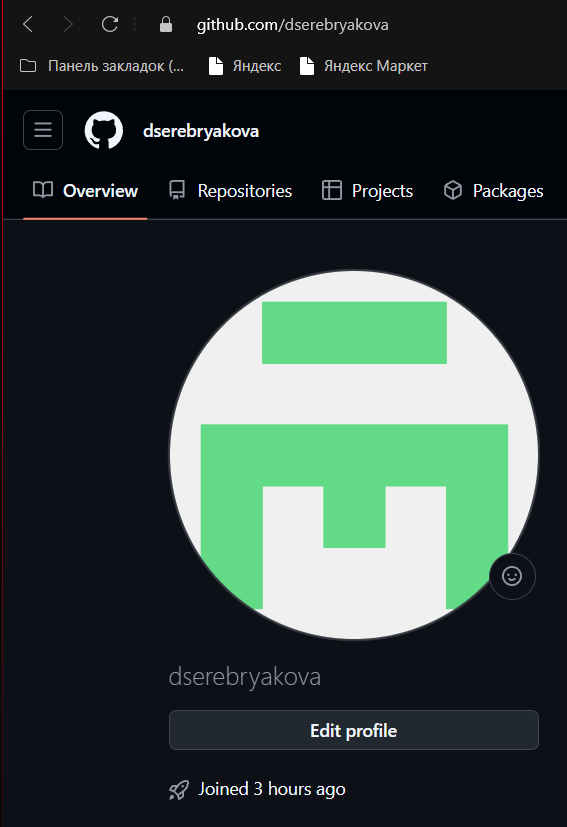{#fig:001 width=70%}

## Базованя настройка git

Открываю виртуальную машину, захожу в терминал. Сделаю 
предварительную конфигурацию git. Ввожу команду git config –global user.name
“”, указывая свое имя, фамилию. Далее ввожу команду git config –global
user.email “work@mail”, указывая в ней свою электронную почту (рис. [-@fig:002]):

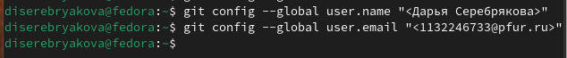{#fig:002 width=70%}

Настраиваю utf-8 в выводе сообщений git, введя предложенную команду (рис. [-@fig:003]):

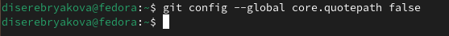{#fig:003 width=70%}

Задаю имя начальной ветки (буду называть её masster). Также задаю
параметр autocrlf со значением input и параметр safecrlf со значением warn (рис. [-@fig:004]):

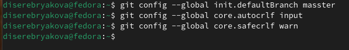{#fig:004 width=70%}

## Создание SSH ключа

Для последующей идентификации пользователя на сервере репозиториев 
необходимо сгенерировать пару ключей (приватный и открытый). Для этого 
ввожу команду ssh-keygen -C “Имя Фамилия, work@email”, указывая свое имя 
(имя владельца) и электронную почту владельца. Ключ автоматически 
сохранится в каталоге ~/.ssh/ (рис. [-@fig:005]):

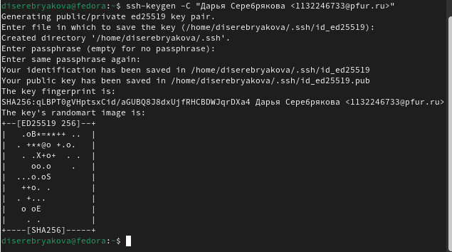{#fig:005 width=70%}

Далее необходимо загрузить сгенерённый открытый ключ. Для этого 
захожу на сайт http: //github.org/ под своей учётной записью и перехожу в меню 
Setting . После этого выбираю в боковом меню SSH and GPG keys и нажимаю
кнопку New SSH key
Копирую из локальной консоли ключ в буфер обмена (рис. [-@fig:006]):

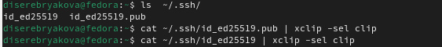{#fig:006 width=70%}

Вставляю скопированный ключ в поле «Key». В поле Title указываю имя 
для ключа. Нажимаю «Add SSH-key», чтобы завершить добавление ключа (рис. [-@fig:007]):

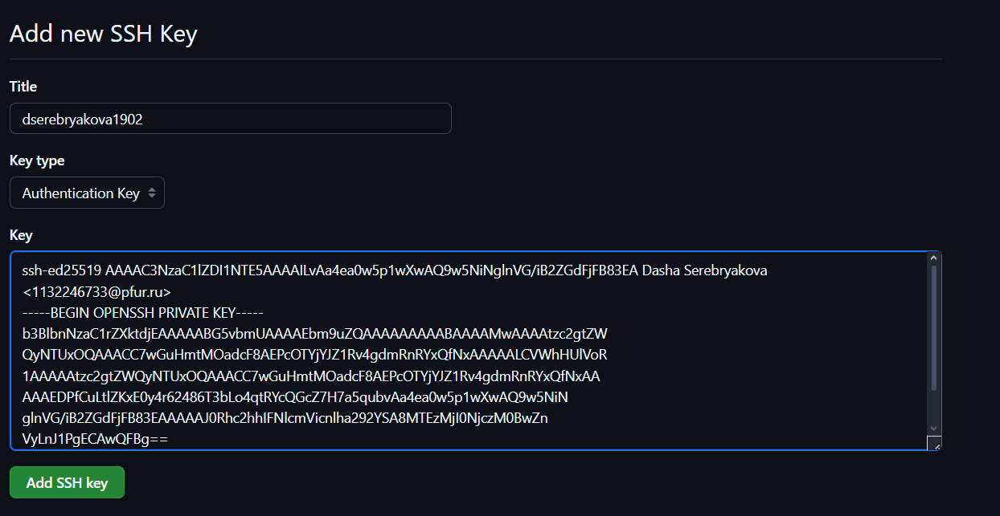{#fig:007 width=70%}

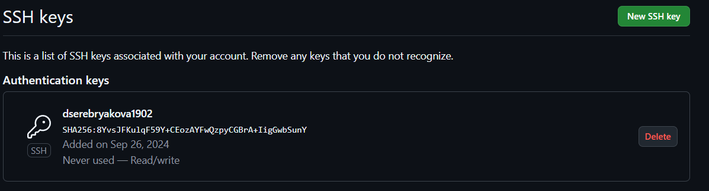{#fig:008 width=70%}

## Создание рабочего пространства и репозитория курса на основе шаблона

Открываю терминал и создаю каталог для предмета «Операционные 
системы», используя команду mkdir с ключом –p (рис. [-@fig:009]):

{#fig:009 width=70%}

## Создание репозиторя курса на основе шаблона

Перехожу на станицу репозитория с шаблоном курса. Далее выбираю Use 
this template
В открывшемся окне задаю имя репозитория (Repository name) 
study_2024–2025_os-intro и создаю репозиторий. Репозиторий создан (рис. [-@fig:010]):

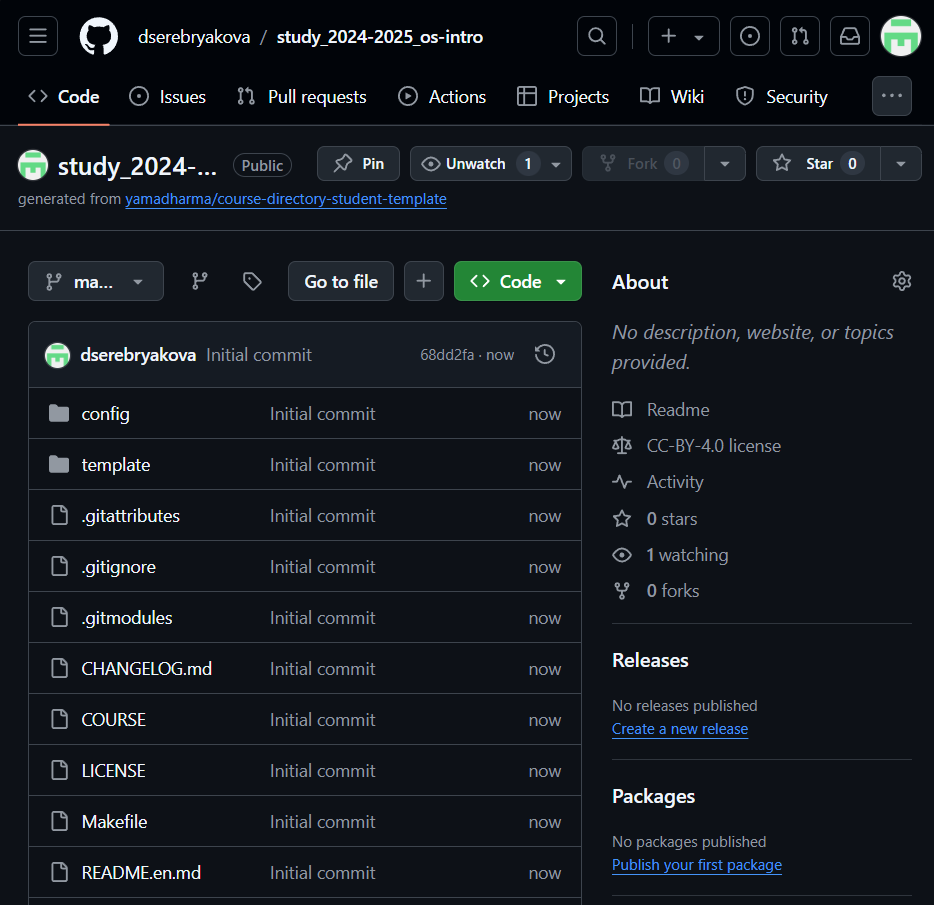{#fig:010 width=70%}

Открываю терминал и перехожу в каталог курса (рис. [-@fig:011]):

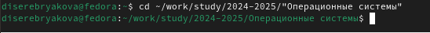{#fig:011 width=70%}

Ссылку для клонирования копирую на странице созданного репозитория (рис. [-@fig:012]):

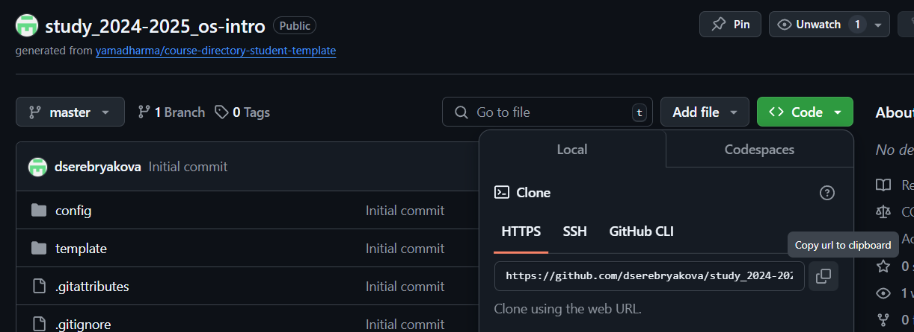{#fig:012 width=70%}

Клонирую созданный репозиторий, используя только что скопированную 
ссылку (рис. [-@fig:013]):

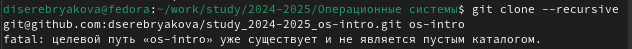{#fig:013 width=70%}

## Настройка каталога курса

Перехожу в каталог курса командой cd (рис. [-@fig:014]):

{#fig:014 width=70%}

Пробую удалить лишние файлы командой rm (рис. [-@fig:015]):

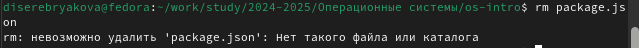{#fig:015 width=70%}

Для создания необходимых каталогов использую команду make (рис. [-@fig:016]):

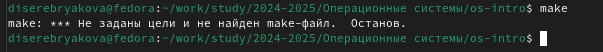{#fig:016 width=70%}

# Вывод

В ходе выполнения работы изучены идеология и применение средств контроля версий. Приобретены практические навыки по работе с системой git

# Список литературы{.unnumbered}

1. Архитектура ЭВМ
