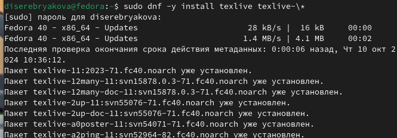
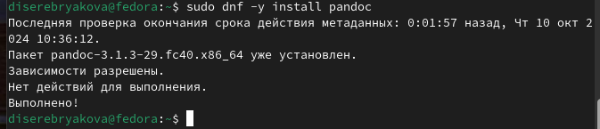
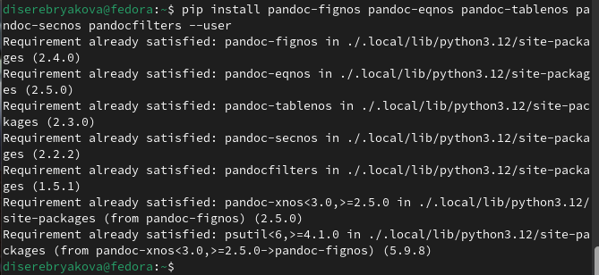
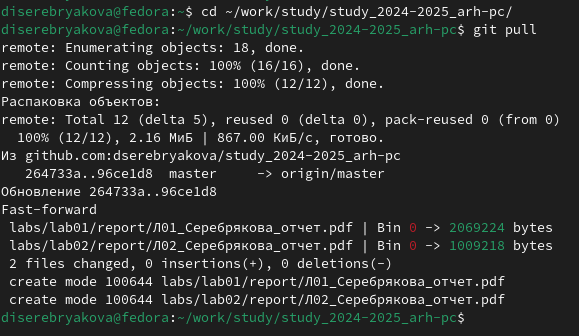
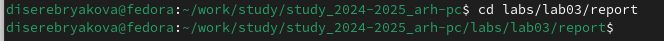
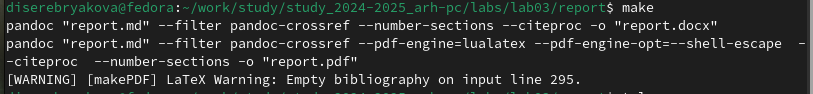
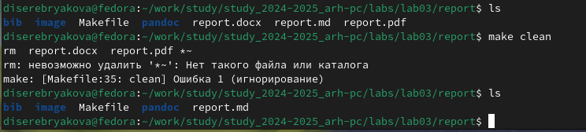
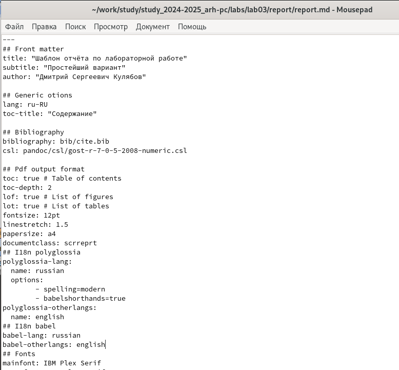
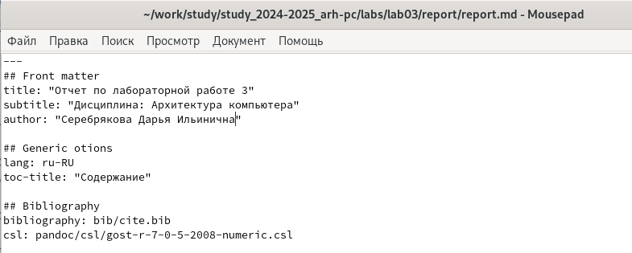
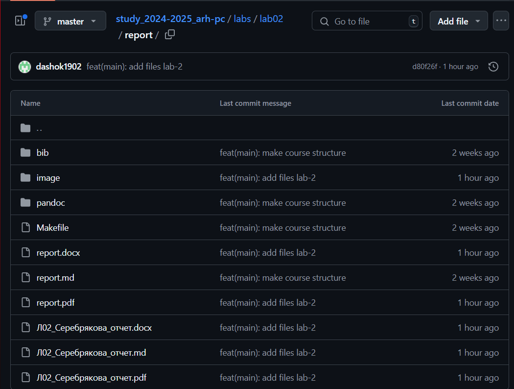

---
## Front matter
title: "Лабораторная работа №3"
subtitle: "Дисциплина: Архитектура компьютера"
author: "Серебрякова Дарья Ильинична"

## Generic otions
lang: ru-RU
toc-title: "Содержание"

## Bibliography
bibliography: bib/cite.bib
csl: pandoc/csl/gost-r-7-0-5-2008-numeric.csl

## Pdf output format
toc: true # Table of contents
toc-depth: 2
lof: true # List of figures
lot: true # List of tables
fontsize: 12pt
linestretch: 1.5
papersize: a4
documentclass: scrreprt
## I18n polyglossia
polyglossia-lang:
  name: russian
  options:
	- spelling=modern
	- babelshorthands=true
polyglossia-otherlangs:
  name: english
## I18n babel
babel-lang: russian
babel-otherlangs: english
## Fonts
mainfont: IBM Plex Serif
romanfont: IBM Plex Serif
sansfont: IBM Plex Sans
monofont: IBM Plex Mono
mathfont: STIX Two Math
mainfontoptions: Ligatures=Common,Ligatures=TeX,Scale=0.94
romanfontoptions: Ligatures=Common,Ligatures=TeX,Scale=0.94
sansfontoptions: Ligatures=Common,Ligatures=TeX,Scale=MatchLowercase,Scale=0.94
monofontoptions: Scale=MatchLowercase,Scale=0.94,FakeStretch=0.9
mathfontoptions:
## Biblatex
biblatex: true
biblio-style: "gost-numeric"
biblatexoptions:
  - parentracker=true
  - backend=biber
  - hyperref=auto
  - language=auto
  - autolang=other*
  - citestyle=gost-numeric
## Pandoc-crossref LaTeX customization
figureTitle: "Рис."
tableTitle: "Таблица"
listingTitle: "Листинг"
lofTitle: "Список иллюстраций"
lotTitle: "Список таблиц"
lolTitle: "Листинги"
## Misc options
indent: true
header-includes:
  - \usepackage{indentfirst}
  - \usepackage{float} # keep figures where there are in the text
  - \floatplacement{figure}{H} # keep figures where there are in the text
---

# Цель работы

Целью работы является освоение процедуры оформления отчетов с помощью легковесного языка разметки Markdown.

# Задание

1. Устаовка необходимого ПО
2. Заполнение отчета по выполнению лабораторной работы №4 c помощью языка разметки Markdown
3. Задания для самостоятельной работы

# Теоретическое введение

Markdown - легковесный язык разметки, созданный с целью обозначения фор матирования в простом тексте, с максимальным сохранением его читаемости человеком, и пригодный для машинного преобразования в языки для продвинутых публикаций. Внутритекстовые формулы делаются аналогично формулам LaTeX. В Markdown вставить изображение в документ можно с помощью непосредственного указания адреса изображения. Синтаксис Markdown для встроенной ссылки состоит из части [link text], представляющей текст гиперссылки, и части (file-name.md) – URL-адреса или имени файла, на который дается ссылка. Markdown поддерживает как встраивание фрагментов кода в предложение, так и их размещение между предложениями в виде отдельных огражденных блоков. Огражденные блоки кода — это простой способ выделить синтаксис для фрагментов кода.

# Выполнение лабораторной работы

## Установка необходимого ПО

Для выполнении лабораторной работы на своей технике необходимо установить следующее ПО: 
TeX Live последней версии. Для начала устанавливаю дистрибутив LaTeX - наиболее популярный набор макрорасширений (или макропакет) системы компьютерной вёрстки TeX, который облегчает набор сложных документов.
Открываю терминал и ввожу команду sudo dnf -y install texlive texlive-\* (рис. [-@fig:001]).

{#fig:001 width=70%}

Далее устанавливаю Pandoc . Pandoc –  это универсальная утилита для работы с текстовыми форматами. Основная сфера применения — форматирование математических и технических текстов.
Ввожу команду sudo dnf -y install pandoc (рис. [-@fig:002]).

{#fig:002 width=70%}

Также устанавливаю необходимые расширения командой pip install pandoc-fignos pandoc-eqnos pandoc-tablenos pandoc-secnos pandocfilters --user (рис. [-@fig:003]).

{#fig:003 width=70%}

## Работа с отчетом с помощью шаблонов

Перехожу в каталог курса, сформированный при выполнении лабораторной работы №2 и обновляю локальный репозиторий, скачав изменения из удаленного репозитория с помощью команды git pull (рис. [-@fig:004]).

{#fig:004 width=70%}

Перехожу в каталог с шаблоном отчета по лабораторной работе №3 (рис. [-@fig:005]).

{#fig:005 width=70%}

Компилирую шаблон с использованием Makefile, вводя команду make (рис. [-@fig:006]).

{#fig:006 width=70%}

Компиляция прошла успешно, сгенерированы файлы report.pdf и report.docx, в чем я убедилась наглядно. Удаляю полученные файлы с использованием Makefile командой make clean. Командой ls проверяю, что файлы report.pdf и report.docx были удалены (рис. [-@fig:007]).

{#fig:007 width=70%}

Открываю файл report.md c помощью текстового редактора mousepad, изучаю структуру этого файла (рис. [-@fig:008]).

{#fig:008 width=70%}

Заполняю отчет с помощью языка разметки Markdown (рис. [-@fig:009]).

{#fig:009 width=70%}

# Задания для самостоятельной работы

В соответствующем каталоге создаю отчет по выполнению лабораторной работы №2 в формате Markdown (рис. [-@fig:010]).

{#fig:010 width=70%}

Загружаю файлы на github (рис. [-@fig:011]).

{#fig:011 width=70%}

# Выводы

В ходе выполнения работы освоены процедуры оформления отчетов с помощью легковесного языка разметки Markdown.

# Список литературы{.unnumbered}

1. Архитектура ЭВМ
