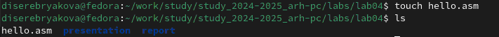
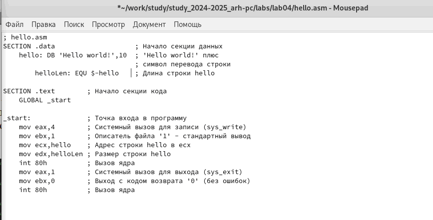
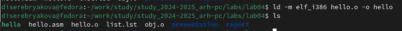
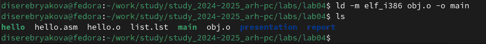
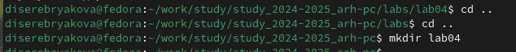
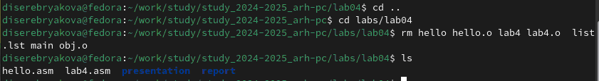

---
## Front matter
title: "Лабораторная работа №4"
subtitle: "Дисциплина: Архитектура компьютера"
author: "Серебрякова Дарья Ильинична"

## Generic otions
lang: ru-RU
toc-title: "Содержание"

## Bibliography
bibliography: bib/cite.bib
csl: pandoc/csl/gost-r-7-0-5-2008-numeric.csl

## Pdf output format
toc: true # Table of contents
toc-depth: 2
lof: true # List of figures
lot: true # List of tables
fontsize: 12pt
linestretch: 1.5
papersize: a4
documentclass: scrreprt
## I18n polyglossia
polyglossia-lang:
  name: russian
  options:
	- spelling=modern
	- babelshorthands=true
polyglossia-otherlangs:
  name: english
## I18n babel
babel-lang: russian
babel-otherlangs: english
## Fonts
mainfont: IBM Plex Serif
romanfont: IBM Plex Serif
sansfont: IBM Plex Sans
monofont: IBM Plex Mono
mathfont: STIX Two Math
mainfontoptions: Ligatures=Common,Ligatures=TeX,Scale=0.94
romanfontoptions: Ligatures=Common,Ligatures=TeX,Scale=0.94
sansfontoptions: Ligatures=Common,Ligatures=TeX,Scale=MatchLowercase,Scale=0.94
monofontoptions: Scale=MatchLowercase,Scale=0.94,FakeStretch=0.9
mathfontoptions:
## Biblatex
biblatex: true
biblio-style: "gost-numeric"
biblatexoptions:
  - parentracker=true
  - backend=biber
  - hyperref=auto
  - language=auto
  - autolang=other*
  - citestyle=gost-numeric
## Pandoc-crossref LaTeX customization
figureTitle: "Рис."
tableTitle: "Таблица"
listingTitle: "Листинг"
lofTitle: "Список иллюстраций"
lotTitle: "Список таблиц"
lolTitle: "Листинги"
## Misc options
indent: true
header-includes:
  - \usepackage{indentfirst}
  - \usepackage{float} # keep figures where there are in the text
  - \floatplacement{figure}{H} # keep figures where there are in the text
---

# Цель работы

Цель данной лабораторной работы - освоить процедуры компиляции и сборки программ, написанных на ассемблере NASM.

# Задание

1. Создание программы Hello world!
2. Работа с транслятором NASM
3. Работа с расширенным синтаксисом командной строки NASM
4. Работа с компоновщиком LD
5. Запуск исполняемого файла
6. Выполнение заданий для самостоятельной работы.

# Теоретическое введение

Основными функциональными элементами любой ЭВМ являются центральный процессор, память и периферийные устройства. Взаимодействие этих устройств осуществляется через общую шину, к которой они подключены. Физически шина представляет собой большое количество проводников, соединяющих устройства друг с другом. В современных компьютерах проводники выполнены в виде электропроводящих дорожек на материнской плате. Основной задачей процессора является обработка информации, а также организация координации всех узлов компьютера. В состав центрального процессора входят следующие устройства:

арифметико-логическое устройство (АЛУ) — выполняет логические и арифметические действия, необходимые для обработки информации, хранящейся в памяти;
устройство управления (УУ) — обеспечивает управление и контроль всех устройств компьютера;
регистры — сверхбыстрая оперативная память небольшого объёма, входящая в состав процессора, для временного хранения промежуточных результатов выполнения инструкций; регистры процессора делятся на два типа: регистры общего назначения и специальные регистры. Для того, чтобы писать программы на ассемблере, необходимо знать, какие регистры процессора существуют и как их можно использовать. Большинство команд в программах написанных на ассемблере используют регистры в каче- стве операндов. Практически все команды представляют собой преобразование данных хранящихся в регистрах процессора, это например пересылка данных между регистрами или между регистрами и памятью, преобразование (арифметические или логические операции) данных хранящихся в регистрах. Доступ к регистрам осуществляется не по адресам, как к основной памяти, а по именам. Каждый регистр процессора архитектуры x86 имеет свое название, состоящее из 2 или 3 букв латинского алфавита. В качестве примера приведем названия основных регистров общего назначения (именно эти регистры чаще всего используются при написании программ):
RAX, RCX, RDX, RBX, RSI, RDI — 64-битные
EAX, ECX, EDX, EBX, ESI, EDI — 32-битные
AX, CX, DX, BX, SI, DI — 16-битные
AH, AL, CH, CL, DH, DL, BH, BL — 8-битные
Другим важным узлом ЭВМ является оперативное запоминающее устройство (ОЗУ). ОЗУ — это быстродействующее энергозависимое запоминающее устройство, которое напрямую взаимодействует с узлами процессора, предназначенное для хранения программ и данных, с которыми процессор непосредственно работает в текущий момент. ОЗУ состоит из одинаковых пронумерованных ячеек памяти. Номер ячейки памяти — это адрес хранящихся в ней данных. Периферийные устройства в составе ЭВМ:

устройства внешней памяти, которые предназначены для долговременного хранения больших объёмов данных.
устройства ввода-вывода, которые обеспечивают взаимодействие ЦП с внешней средой.
В основе вычислительного процесса ЭВМ лежит принцип программного управления. Это означает, что компьютер решает поставленную задачу как последовательность действий, записанных в виде программы.

Коды команд представляют собой многоразрядные двоичные комбинации из 0 и 1. В коде машинной команды можно выделить две части: операционную и адресную. В операционной части хранится код команды, которую необходимо выполнить. В адресной части хранятся данные или адреса данных, которые участвуют в выполнении данной операции. При выполнении каждой команды процессор выполняет определённую последовательность стандартных действий, которая называется командным циклом процессора. Он заключается в следующем:

формирование адреса в памяти очередной команды;
считывание кода команды из памяти и её дешифрация;
выполнение команды;
переход к следующей команде.
Язык ассемблера (assembly language, сокращённо asm) — машинно-ориентированный язык низкого уровня. NASM — это открытый проект ассемблера, версии которого доступны под различные операционные системы и который позволяет получать объектные файлы для этих систем. В NASM используется Intel-синтаксис и поддерживаются инструкции x86-64.

# Выполнение лабораторной работы

Захожу в каталог Лабораторной работы 4, проверяю его содержимое и убеждаюсь, что шаблон для заполнения отчета присутствует. Копирую его с новым именем – Л04_Серебрякова_отчет и приступаю к его заполнению по ходу выполнения лабораторной работы (рис. [-@fig:001]).

{#fig:001 width=70%}

## Программа Hello world!

Командой touch создаю текстовый файл с именем hello.asm (рис. [-@fig:002]).

{#fig:002 width=70%}

Открываю файл с помощью текстового редактора mousepad и ввожу в него предложенный текст (рис. [-@fig:003]).

{#fig:003 width=70%}

## Транслятор NASM

NASM превращает текст программы в объектный код. Например, для компиляции приведённого выше текста программы «Hello World» пишу команду nasm -f elf hello.asm . Для выполнения этого шага потребоваось установить пакет, предоставляющий команду nasm. После установки, прописываю команду повторно, затем использую команду ls и вижу, что создан файл hello.o (рис. [-@fig:004]).

{#fig:004 width=70%}

## Расширенный синтаксис командной строки NASM

Ввожу команду  nasm -o obj.o -f elf -g -l list.lst hello.asm . Данная команда должна скомпилировать исходный файл hello.asm в obj.o (опция -o позволяет задать имя объектного файла, в данном случае obj.o), при этом формат выходного файла должен быть elf, и в него должны быть включены символы для отладки (опция -g). Кроме того, должен быть создан файл листинга list.lst (опция -l). С помощью команды ls проверяю, что файлы были созданы (рис. [-@fig:005]).

{#fig:005 width=70%}

## Компоновщик LD

Передаю объектный файл hello.o на обработку компоновщику LD, чтобы получить исполняемый файл hello. Командой ls проверяю, что файл создан (рис. [-@fig:006]).

{#fig:006 width=70%}

Ключ -o с последующим значением задаёт в данном случае имя создаваемого исполняемого файла. Для наглядности ввожу следующую команду: ld -m elf_i386 obj.o -o main (рис. [-@fig:007]).

{#fig:007 width=70%}

Исполняемый файл будет иметь имя main, т.к. после ключа -о было задано значение main. Объектный файл, из которого собран этот исполняемый файл, имеет имя obj.o

## Запуск исполняемого файла

Запускаю на выполнение созданный исполняемый файл, находящийся в текущем каталоге, набрав в командной строке ./hello (рис. [-@fig:008]).

{#fig:008 width=70%}

# Выполнение заданий для самостоятельной работы

С помощью команды cp создаю копию файла hello.asm с именем lab4.asm (рис. [-@fig:009]).

{#fig:009 width=70%}

Открываю файл lab4.asm в текстовом редакторе mousepad, редактирую его так, чтобы вместо Hello world! на экран выводилась строка с моими фамилией и именем (рис. [-@fig:010]).

{#fig:010 width=70%}

Компилирую текст программы в объектный файл. Проверяю командой ls, что файл lab4.o создан (рис. [-@fig:011]).

{#fig:011 width=70%}

Передаю объектный файл lab4.o на обработку компоновщику LD, чтобы получить исполняемый файл lab4.  Запускаю исполняемый файл lab4, и вижу,  что на экран действительно выводятся мои фамилия и имя (рис. [-@fig:012]).

{#fig:012 width=70%}

На данном этапе выполнения заданий я заметила, что в начале выполнения лабораторной работы неправильно поняла один из шагов, а точнее, не создала каталог lab04, а начала работать в уже существующем каталоге lab4, находящемся в папке labs. Чтобы исправиться, возвращаюсь из папки labs и создаю необходимый каталог командой mkdir (рис. [-@fig:013]).

{#fig:013 width=70%}

Теперь необходимо перенести созданные файлы в новую папку. Копирую из текущего каталога файлы с помощью утилиты cp, указывая вместо имени файла символ *, чтобы скопировать все файлы. Команда проигнорирует директории в этом каталоге, т. к. не указан ключ –r. Проверяю с помощью ls правильность выполнения команды (рис. [-@fig:014]).

{#fig:014 width=70%}

Возвращаюсь в папку, откуда копировала файлы и удаляю оттуда то, что должно храниться в другом месте (рис. [-@fig:015]).

{#fig:015 width=70%}

Завершаю заполнение Л04_Серебрякова_отчет.md и отправляю все необходимые данные на GitHub. С помощью команд git add . и git commit добавляю файлы на GitHub, соответствующе комментируя действие 

# Выводы

При выполнении данной лабораторной работы я освоила процедуры компиляции и сборки программ, написанных на ассемблере NASM

# Список литературы{.unnumbered}

1. https://esystem.rudn.ru/pluginfile.php/1584628/mod_resource/content/1/%D0%9B%D0%B0%D0%B1%D0%BE%D1%80%D0%B0%D1%82%D0%BE%D1%80%D0%BD%D0%B0%D1%8F%20%D1%80%D0%B0%D0%B1%D0%BE%D1%82%D0%B0%20%E2%84%965.pdf 
