---
## Front matter
title: "Отчет по лабораторной работе №6"
subtitle: "Дисциплина: Архитектура компьютера"
author: "Серебрякова Дарья Ильинична"

## Generic otions
lang: ru-RU
toc-title: "Содержание"

## Bibliography
bibliography: bib/cite.bib
csl: pandoc/csl/gost-r-7-0-5-2008-numeric.csl

## Pdf output format
toc: true # Table of contents
toc-depth: 2
lof: true # List of figures
lot: true # List of tables
fontsize: 12pt
linestretch: 1.5
papersize: a4
documentclass: scrreprt
## I18n polyglossia
polyglossia-lang:
  name: russian
  options:
	- spelling=modern
	- babelshorthands=true
polyglossia-otherlangs:
  name: english
## I18n babel
babel-lang: russian
babel-otherlangs: english
## Fonts
mainfont: IBM Plex Serif
romanfont: IBM Plex Serif
sansfont: IBM Plex Sans
monofont: IBM Plex Mono
mathfont: STIX Two Math
mainfontoptions: Ligatures=Common,Ligatures=TeX,Scale=0.94
romanfontoptions: Ligatures=Common,Ligatures=TeX,Scale=0.94
sansfontoptions: Ligatures=Common,Ligatures=TeX,Scale=MatchLowercase,Scale=0.94
monofontoptions: Scale=MatchLowercase,Scale=0.94,FakeStretch=0.9
mathfontoptions:
## Biblatex
biblatex: true
biblio-style: "gost-numeric"
biblatexoptions:
  - parentracker=true
  - backend=biber
  - hyperref=auto
  - language=auto
  - autolang=other*
  - citestyle=gost-numeric
## Pandoc-crossref LaTeX customization
figureTitle: "Рис."
tableTitle: "Таблица"
listingTitle: "Листинг"
lofTitle: "Список иллюстраций"
lotTitle: "Список таблиц"
lolTitle: "Листинги"
## Misc options
indent: true
header-includes:
  - \usepackage{indentfirst}
  - \usepackage{float} # keep figures where there are in the text
  - \floatplacement{figure}{H} # keep figures where there are in the text
---

# Цель работы

Цель данной лабораторной работы - освоение арифметческих инструкций языка ассемблера NASM

# Задания

1. Символьные и численные данные в NASM
2. Выполнение арифметических операций в NASM
3. Выполнение заданий для самостоятельной работы

# Теоретическое введение

Большинство инструкций на языке ассемблера требуют обработки операндов. Адрес операнда предоставляет место, где хранятся данные, подлежащие обработке. Это могут быть данные хранящиеся в регистре или в ячейке памяти.

1. Регистровая адресация – операнды хранятся в регистрах и в команде используются имена этих регистров, например: mov ax,bx.
2. Непосредственная адресация – значение операнда задается непосредственно в команде, Например: mov ax,2.
3. Адресация памяти – операнд задает адрес в памяти. В команде указывается символическое обозначение ячейки памяти, над содержимым которой требуется выполнить операцию.

Ввод информации с клавиатуры и вывод её на экран осуществляется в символьном виде. Кодирование этой информации производится согласно кодовой таблице символов ASCII. ASCII – сокращение от American Standard Code for Information Interchange (Американский стандартный код для обмена информацией). Согласно стандарту ASCII каждый символ кодируется одним байтом. Среди инструкций NASM нет такой, которая выводит числа (не в символьном виде). Поэтому, например, чтобы вывести число, надо предварительно преобразовать его цифры в ASCII-коды этих цифр и выводить на экран эти коды, а не само число. Если же выводить число на экран непосредственно, то экран воспримет его не как число, а как последовательность ASCII-символов – каждый байт числа будет воспринят как один ASCII-символ – и выведет на экран эти символы. Аналогичная ситуация происходит и при вводе данных с клавиатуры. Введенные данные будут представлять собой символы, что сделает невозможным получение корректного результата при выполнении над ними арифметических операций. Для решения этой проблемы необходимо проводить преобразование ASCII символов в числа и обратно

# Выполнение лабораторной работы
## Символьные и численные данные в nasm

Командой mkdir создала каталог для программ лабораторной работы № 6, перешла в него и создала файл lab6-1.asm (рис. [-@fig:001]).

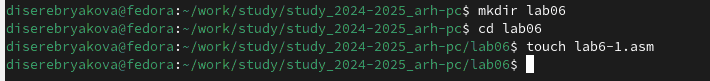{#fig:001 width=70%}

Копирую в текущий каталог файл in_out.asm с помощью утилиты cp, т.к. он будет использоваться в других программах (рис. [-@fig:002]).

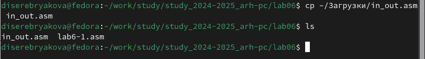{#fig:002 width=70%}

Открываю созданный файл lab7-1.asm, вставляю в него программу вывода значения регистра eax  (рис. [-@fig:003]).

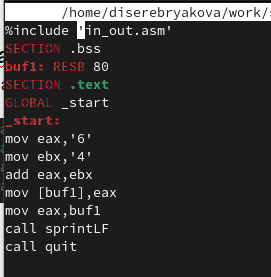{#fig:003 width=70%}

Создаю исполняемый файл программы и запускаю его. Вывод программы: символ j. Это происходит потому, что код символа 6 равен 00110110 в двоичном представлении (или 54 в десятичном представлении), а код символа 4 – 00110100 (52). Команда add eax,ebx запишет в регистр eax сумму кодов – 01101010 (106), что в свою очередь является кодом символа j (рис. [-@fig:004]).

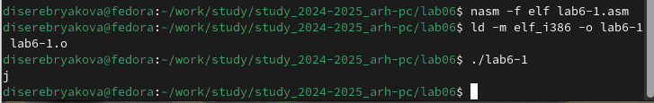{#fig:004 width=70%}

Далее изменю текст программы и вместо символов, запишу в регистры числа 6 и 4 (рис. [-@fig:005]).

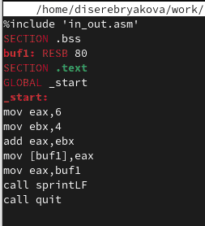{#fig:005 width=70%}

Создаю исполняемый файл и запускаю его. Теперь вывелся символ с кодом 10, это символ перевода строки, этот символ не отображается при выводе на экран (рис. [-@fig:006]).

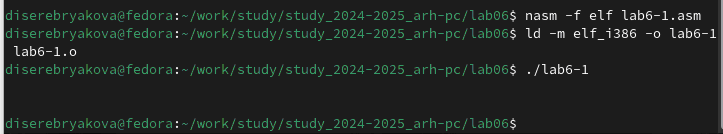{#fig:006 width=70%}

Командой touch создаю файл lab6-2.asm в каталоге lab06 и ввожу в него текст программы из предложенного листинга 6.2 (рис. [-@fig:007]).

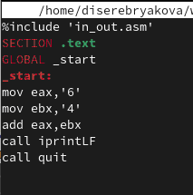{#fig:007 width=70%}

Создаю исполняемый файл и запускаю его. В результате работы программы получила число 106. В данном случае, как и в первом, команда add складывает коды символов ‘6’ и ‘4’ (54+52=106). Однако, в отличии от программы из листинга 6.1, функция iprintLF позволяет вывести число, а не символ, кодом которого является это число (рис. [-@fig:008]).

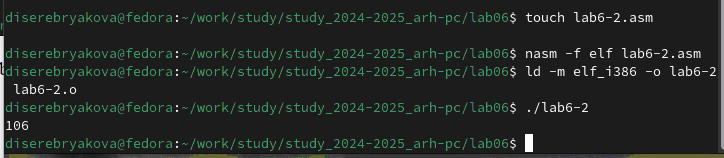{#fig:008 width=70%}

Заменяю в тексте программы в файле lab6-2.asm символы "6" и "4" на числа 6 и 4. Создаю исполняемый файл и запускаю его. Теперь программа складывает не соответствующие символам коды в системе ASCII, а сами числа, поэтому вывод 10 (рис. [-@fig:009]).

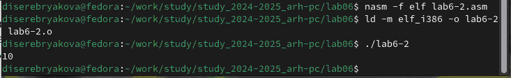{#fig:009 width=70%}

Заменяю в тексте программы функцию iprintLF на iprint. Создаю и запускаю новый исполняемый файл. Вывод изменился, потому что iprint не добавляет к выводу символ переноса строки, в отличие от iprintLF (рис. [-@fig:010]).

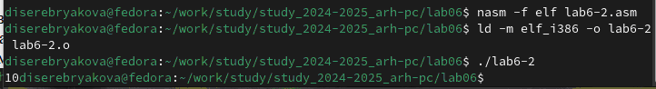{#fig:010 width=70%}

## Выполнение арифметических операций в nasm

Командой touch создала файл lab6-3.asm (рис. [-@fig:011]).

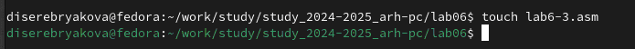{#fig:011 width=70%}

Изучила текст программы листинга 6.3 и ввела его в lab6-3.asm (рис. [-@fig:012]).

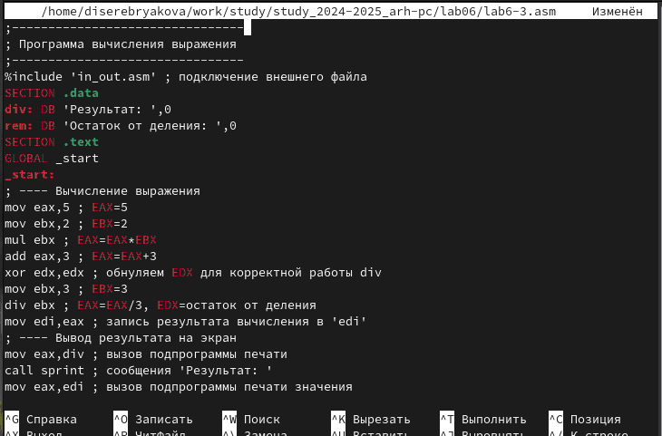{#fig:012 width=70%}

Создаю исполняемый файл и запускаю его (рис. [-@fig:013]).

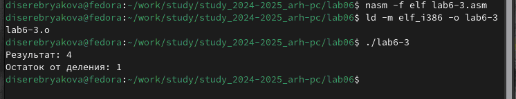{#fig:013 width=70%}

Изменяю текст программы для вычисления выражения f(x) = (4 ∗ 6 + 2)/5 (рис. [-@fig:014]).

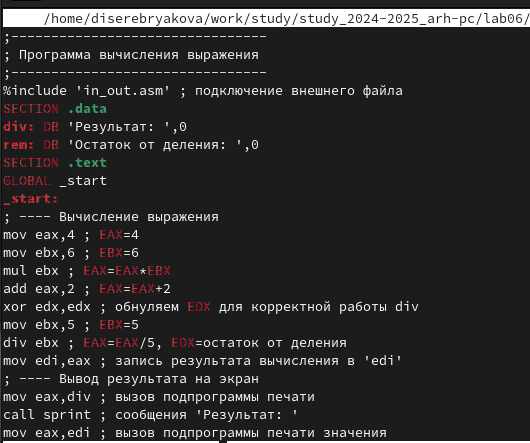{#fig:014 width=70%}

Создаю исполняемый файл и запускаю его. Результат вычислений изменился (рис. [-@fig:015]).

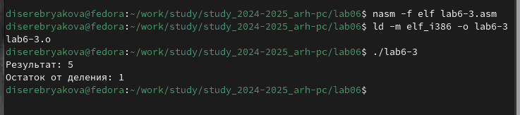{#fig:015 width=70%}

Командой touch создаю файл variant.asm в каталоге lab06. Внимательно изучаю текст программы из листинга 6.4 и ввожу его в только что созданный файл (рис. [-@fig:016]).

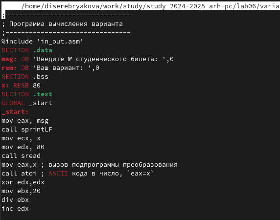{#fig:016 width=70%}

Создаю исполняемый файл и запускаю его. Ввожу номер своего студенческого билета и вижу, что мой вариант 14 (рис. [-@fig:017]).

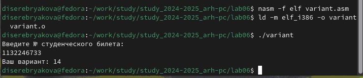{#fig:017 width=70%}

## Ответы на вопросы

1. За вывод на экран сообщения ‘Ваш вариант:’ отвечают следующие строки (рис. [-@fig:018]).

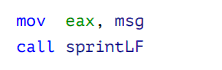{#fig:018 width=70%}

2. Указанные инструкции отвечают за то, чтобы положить адрес вводимой строки x в регистр ecx, далее записать в регистр edx длину вводимой строки (80) и call sread - вызвать подпрограммы из внешнего файла, обеспечивающую ввод сообщения с клавиатуры

3. call atoi используется для вызова подпрограммы из внешнего файла, которая преобразует ascii-код символа в целое число и записывает результат в регистр eax

4.  За вычисление варианта отвечают следующие строки: (рис. [-@fig:019]).

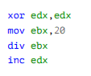{#fig:019 width=70%}

5. При выполнении инструкции div ebx остаток от деления записывается в регистр edx

6. Инструкция inc edx увеличивает значение регистра edx на 1

7. За вывод результатов вычислений на экран отвечают следующие строки: (рис. [-@fig:020]).

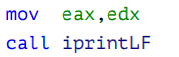{#fig:020 width=70%}

# Выполенение заданий для самостоятельной работы

Командой touch создаю файл lab6-4.asm для выполнения задания (рис. [-@fig:021]).

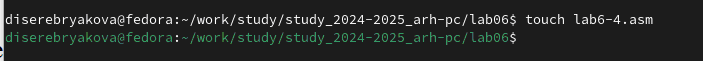{#fig:021 width=70%}

Захожу в только что созданный файл и пишу в нем программу для вычисления заданного выражения (мой вариант – 14) (рис. [-@fig:022]).

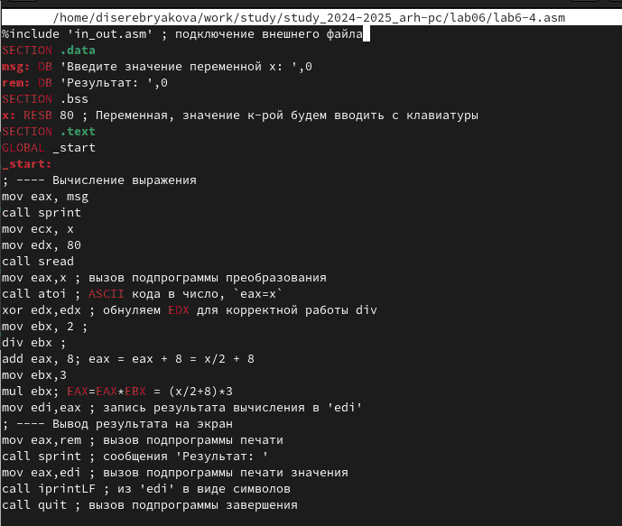{#fig:022 width=70%}

Создаю исполняемый файл и запускаю его. Проверяю работу программы на двух предложенных значениях. Результат вычислений программы совпадает с результатом вычисления выражения вручную, значит программа написана верно. Задание выполнено (рис. [-@fig:023]).

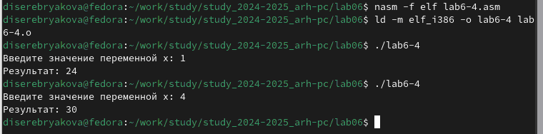{#fig:023 width=70%}

# Выводы

При выполнении данной лабораторной работы я освоила арифметические инструкции языка ассемблера NASM

# Список литературы{.unnumbered}

1. Лабораторная работа 6
