---
## Front matter
title: "Лабораторная работа №7"
subtitle: "Дисциплина: Архитектура компьютера"
author: "Серебрякова Дарья Ильинична"

## Generic otions
lang: ru-RU
toc-title: "Содержание"

## Bibliography
bibliography: bib/cite.bib
csl: pandoc/csl/gost-r-7-0-5-2008-numeric.csl

## Pdf output format
toc: true # Table of contents
toc-depth: 2
lof: true # List of figures
lot: true # List of tables
fontsize: 12pt
linestretch: 1.5
papersize: a4
documentclass: scrreprt
## I18n polyglossia
polyglossia-lang:
  name: russian
  options:
	- spelling=modern
	- babelshorthands=true
polyglossia-otherlangs:
  name: english
## I18n babel
babel-lang: russian
babel-otherlangs: english
## Fonts
mainfont: IBM Plex Serif
romanfont: IBM Plex Serif
sansfont: IBM Plex Sans
monofont: IBM Plex Mono
mathfont: STIX Two Math
mainfontoptions: Ligatures=Common,Ligatures=TeX,Scale=0.94
romanfontoptions: Ligatures=Common,Ligatures=TeX,Scale=0.94
sansfontoptions: Ligatures=Common,Ligatures=TeX,Scale=MatchLowercase,Scale=0.94
monofontoptions: Scale=MatchLowercase,Scale=0.94,FakeStretch=0.9
mathfontoptions:
## Biblatex
biblatex: true
biblio-style: "gost-numeric"
biblatexoptions:
  - parentracker=true
  - backend=biber
  - hyperref=auto
  - language=auto
  - autolang=other*
  - citestyle=gost-numeric
## Pandoc-crossref LaTeX customization
figureTitle: "Рис."
tableTitle: "Таблица"
listingTitle: "Листинг"
lofTitle: "Список иллюстраций"
lotTitle: "Список таблиц"
lolTitle: "Листинги"
## Misc options
indent: true
header-includes:
  - \usepackage{indentfirst}
  - \usepackage{float} # keep figures where there are in the text
  - \floatplacement{figure}{H} # keep figures where there are in the text
---

# Цель работы

Изучение команд условного и безусловного переходов. Приобретение навыков написания
программ с использованием переходов. Знакомство с назначением и структурой файла
листинга

# Задания

1. Реализация переходов в NASM
2. Изучение структуры файла листинга

# Теоретическое введение

Для реализации ветвлений в ассемблере используются так называемые команды передачи
управления или команды перехода. Можно выделить 2 типа переходов:
• условный переход – выполнение или не выполнение перехода в определенную точку
программы в зависимости от проверки условия.
• безусловный переход – выполнение передачи управления в определенную точку программы без каких-либо условий.

Безусловный переход выполняется инструкцией jmp (от англ. jump – прыжок), которая
включает в себя адрес перехода, куда следует передать управление:
jmp <адрес_перехода>
Адрес перехода может быть либо меткой, либо адресом области памяти, в которую предварительно помещен указатель перехода. Кроме того, в качестве операнда можно использовать
имя регистра, в таком случае переход будет осуществляться по адресу, хранящемуся в этом
регистре 

Как отмечалось выше, для условного перехода необходима проверка какого-либо условия.
В ассемблере команды условного перехода вычисляют условие перехода анализируя флаги
из регистра флагов.

Флаг – это бит, принимающий значение 1 («флаг установлен»), если выполнено некоторое
условие, и значение 0 («флаг сброшен») в противном случае. Флаги работают независимо
друг от друга, и лишь для удобства они помещены в единый регистр — регистр флагов, отражающий текущее состояние процессора. 

Листинг (в рамках понятийного аппарата NASM) — это один из выходных файлов, создаваемых транслятором. Он имеет текстовый вид и нужен при отладке программы, так как
кроме строк самой программы он содержит дополнительную информацию.

Все ошибки и предупреждения, обнаруженные при ассемблировании, транслятор выводит
на экран, и файл листинга не создаётся.
Итак, структура листинга:
• номер строки — это номер строки файла листинга (нужно помнить, что номер строки в
файле листинга может не соответствовать номеру строки в файле с исходным текстом
программы);
• адрес — это смещение машинного кода от начала текущего сегмента;
• машинный код представляет собой ассемблированную исходную строку в виде шестнадцатеричной последовательности. (например, инструкция int 80h начинается по смещению 00000020 в сегменте кода; далее идёт машинный код, в который ассемблируется
инструкция, то есть инструкция int 80h ассемблируется в CD80 (в шестнадцатеричном
представлении); CD80 — это инструкция на машинном языке, вызывающая прерывание
ядра);
• исходный текст программы — это просто строка исходной программы вместе с комментариями (некоторые строки на языке ассемблера, например, строки, содержащие
только комментарии, не генерируют никакого машинного кода, и поля «смещение» и
«исходный текст программы» в таких строках отсутствуют, однако номер строки им
присваивается).

# Выполнение лабораторной работы

## Реализация переходов в NASM

Создаю каталог для программам лабораторной работы № 7, перехожу в него и создаю файл lab7-1.asm (рис. [-@fig:001]).

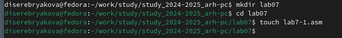{#fig:001 width=70%}

Ввожу в файл lab7-1.asm текст программы из предложенного листинга (рис. [-@fig:002]).

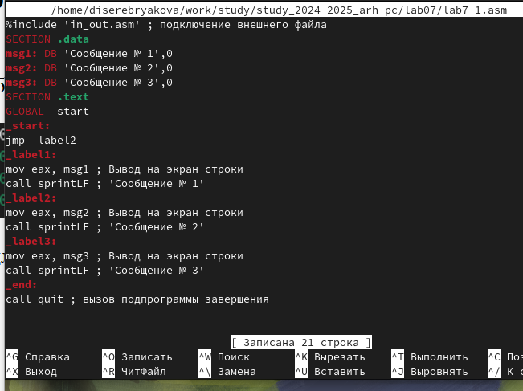{#fig:002 width=70%}

Копирую файл in_out.asm в каталог lab07. Создаю исполняемый файл и запускаю его (рис. [-@fig:003]).

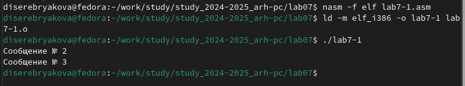{#fig:003 width=70%}

Таким образом, использование инструкции jmp _label2 меняет порядок исполнения инструкций и позволяет выполнить инструкции начиная с метки _label2, пропустив вывод первого сообщения. 

Далее изменяю текст программы в соответствии с предложенным листингом. Создаю исполняемый файл и запускаю его (рис. [-@fig:004]).

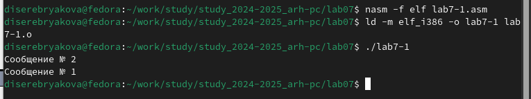{#fig:004 width=70%}

В результате изменения текста программы поменялся порядок выполнения инструкций. Выполнение инструкций началось с метки _label2, она направила на ветку _label1, которая отправляет в конец программы.

Изменяю текст программы, чтобы программа выводила сообщения 3, 2, 1 (рис. [-@fig:005]).

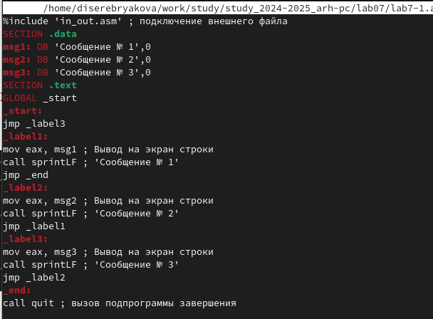{#fig:005 width=70%}

Создаю исполняемый файл и запускаю его  (рис. [-@fig:006]).

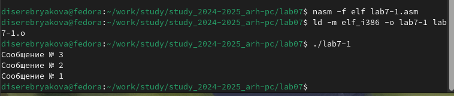{#fig:006 width=70%}

Вывод моей программы совпадает с тем, что должно быть, значит текст программы изменен верно.

Создаю файл lab7-2.asm в каталоге lab07. Внимательно изучаю текст программы из предложенного листинга и ввожу его в lab7-2.asm. Создаю исполняемый файл и запускаю его (рис. [-@fig:007]).

{#fig:007 width=70%}

Проверяю работу программы для различных значений В, все выполняется верно

## Изучение структуры файлов листинга

Создаю файл листинга для программы из файла lab7-2.asm и открываю его с помощью текстового редактора mcedit (рис. [-@fig:008]).

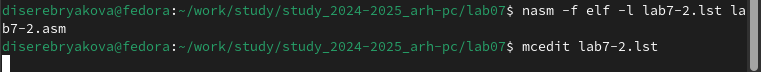{#fig:008 width=70%}

Листинг программы имеет три столбца, в которых отображаются команды исходной ассемблерной программы и соответствующие им объектные коды:

1. Левый столбец содержит шестнадцатеричное значение смещения адреса команды (счетчик команд — IP) от начала сегмента;

2. правый столбец содержит операторы и псевдооператоры ассемблера (команды и директивы программы);

3. в средней части размещены коды: для сегмента стека и сегмента данных — числа, запоминаемые в соответствующих ячейках памяти; для сегмента команд это коды машинных команд МП, соответствующих операторам ассемблера (рис. [-@fig:009]).

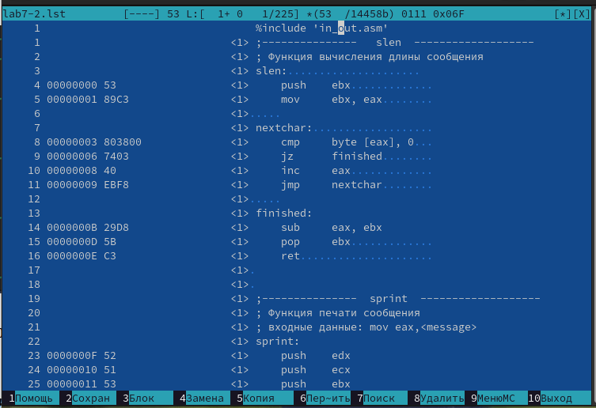{#fig:009 width=70%}

## Выполнение заданий для самостоятельной работы

Для выполнения первого задания командой touch создаю файл lab7-3copy.asm, открываю его и пишу текст необходимой программы (рис. [-@fig:010]).

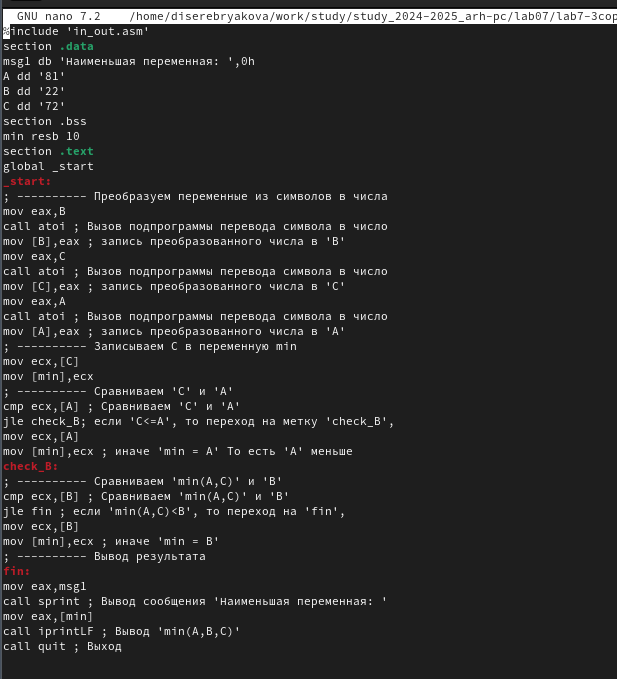{#fig:010 width=70%}

Создаю исполняемый файл и проверяю правильность написанной программы (рис. [-@fig:011]).

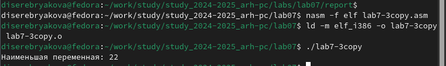{#fig:011 width=70%}

Наименьшая переменная найдена верно, значит программа написана правильно. Приступаю к выполнению второго задания. Создаю файл lab7-4.asm и пишу в нем текст программы. Начало (рис. [-@fig:012]).

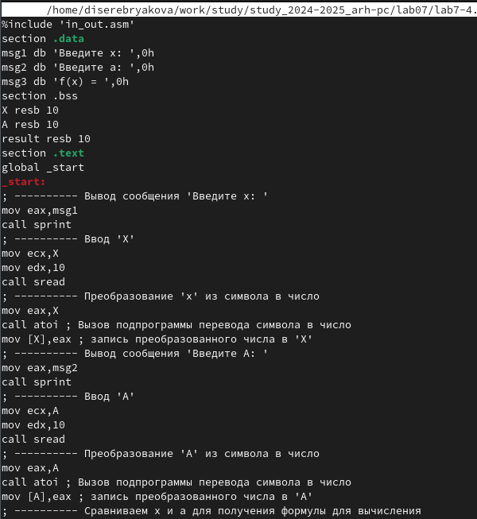{#fig:012 width=70%}

Конец (рис. [-@fig:013]).

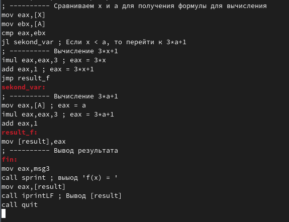{#fig:013 width=70%}

Создаю исполняемый файл, запускаю его и проверяю работу программы на предложенных для моего варианта значениях (рис. [-@fig:014]).

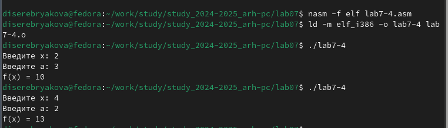{#fig:014 width=70%}

Программа выводит верный результат, а это значит, что она написана верно.

# Выводы

В ходе выполнения лабораторной работы были изучены команды условного и безусловного переходов, прибретены навыки написания программ с использованием переходов и ознакомление с назначением и структурой файла листинга

# Список литературы{.unnumbered}

1. Лабораторная работа №7
