---
## Front matter
title: "Лабораторная работа №8"
subtitle: "Дисциплина: Архитектура компьютера"
author: "Серебрякова Дарья Ильинична"

## Generic otions
lang: ru-RU
toc-title: "Содержание"

## Bibliography
bibliography: bib/cite.bib
csl: pandoc/csl/gost-r-7-0-5-2008-numeric.csl

## Pdf output format
toc: true # Table of contents
toc-depth: 2
lof: true # List of figures
lot: true # List of tables
fontsize: 12pt
linestretch: 1.5
papersize: a4
documentclass: scrreprt
## I18n polyglossia
polyglossia-lang:
  name: russian
  options:
	- spelling=modern
	- babelshorthands=true
polyglossia-otherlangs:
  name: english
## I18n babel
babel-lang: russian
babel-otherlangs: english
## Fonts
mainfont: IBM Plex Serif
romanfont: IBM Plex Serif
sansfont: IBM Plex Sans
monofont: IBM Plex Mono
mathfont: STIX Two Math
mainfontoptions: Ligatures=Common,Ligatures=TeX,Scale=0.94
romanfontoptions: Ligatures=Common,Ligatures=TeX,Scale=0.94
sansfontoptions: Ligatures=Common,Ligatures=TeX,Scale=MatchLowercase,Scale=0.94
monofontoptions: Scale=MatchLowercase,Scale=0.94,FakeStretch=0.9
mathfontoptions:
## Biblatex
biblatex: true
biblio-style: "gost-numeric"
biblatexoptions:
  - parentracker=true
  - backend=biber
  - hyperref=auto
  - language=auto
  - autolang=other*
  - citestyle=gost-numeric
## Pandoc-crossref LaTeX customization
figureTitle: "Рис."
tableTitle: "Таблица"
listingTitle: "Листинг"
lofTitle: "Список иллюстраций"
lotTitle: "Список таблиц"
lolTitle: "Листинги"
## Misc options
indent: true
header-includes:
  - \usepackage{indentfirst}
  - \usepackage{float} # keep figures where there are in the text
  - \floatplacement{figure}{H} # keep figures where there are in the text
---

# Цель работы

Приобретение навыков написания программ с использованием циклов и обработкой аргументов командной строки

# Задание

1. Реализовать циклы в nasm
2. Познакомиться с обработкой аргументов командной строки

# Теоретическое введение

Стек — это структура данных, организованная по принципу LIFO («Last In — First Out»
или «последним пришёл — первым ушёл»). Стек является частью архитектуры процессора и
реализован на аппаратном уровне. Для работы со стеком в процессоре есть специальные
регистры (ss, bp, sp) и команды.
Основной функцией стека является функция сохранения адресов возврата и передачи
аргументов при вызове процедур. Кроме того, в нём выделяется память для локальных
переменных и могут временно храниться значения регистров.
На рис. 8.1 показана схема организации стека в процессоре.
Стек имеет вершину, адрес последнего добавленного элемента, который хранится в регистре esp (указатель стека). Противоположный конец стека называется дном. Значение,
помещённое в стек последним, извлекается первым. При помещении значения в стек указатель стека уменьшается, а при извлечении — увеличивается.
Для стека существует две основные операции:
• добавление элемента в вершину стека (push);
• извлечение элемента из вершины стека (pop).

Команда push размещает значение в стеке, т.е. помещает значение в ячейку памяти, на
которую указывает регистр esp, после этого значение регистра esp увеличивается на 4.
Данная команда имеет один операнд — значение, которое необходимо поместить в стек.

Команда pop извлекает значение из стека, т.е. извлекает значение из ячейки памяти, на
которую указывает регистр esp, после этого уменьшает значение регистра esp на 4. У этой
команды также один операнд, который может быть регистром или переменной в памяти.
Нужно помнить, что извлечённый из стека элемент не стирается из памяти и остаётся как
“мусор”, который будет перезаписан при записи нового значения в стек.

# Выполнение лабораторной работы
## Реализация циклов в NASM

Создала каталог для программ лабораторной работы 8, перешла в него и создала файл lab8-1.asm (рис. [-@fig:001]).

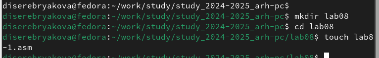{#fig:001 width=70%}

В только что созданный файл вписываю программу из предложенного листинга (рис. [-@fig:002]).

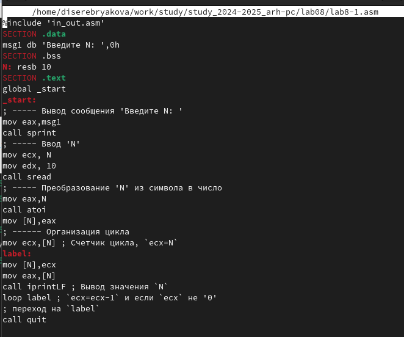{#fig:002 width=70%}

Создаю исполняемый файл и запускаю его (рис. [-@fig:003]).

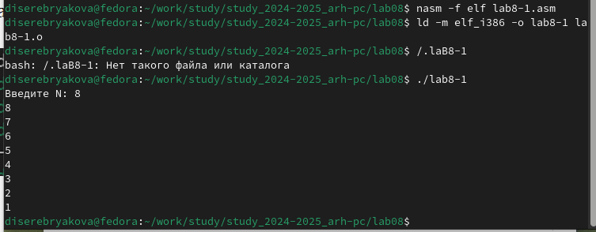{#fig:003 width=70%}

Поменяла программу, добавив изменение значение регистра ecx в цикле. Создала исполняемый файл и запустила его (рис. [-@fig:004]).

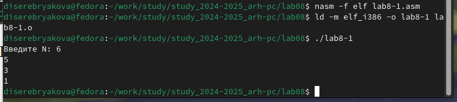{#fig:004 width=70%}

Регистр ecx в цикле принимает значения «через одно», то есть каждое следующее значение меньше предыдущего на 2. За счет этого число проходов цикла в два раза меньше введенного с клавиатуры числа N

Для использования регистра ecx в цикле и сохранения корректности работы программы можно использовать стек. Вношу изменения в текст программы добавив команды push и pop (добавления в стек и извлечения из стека) для сохранения значения счетчика цикла loop (рис. [-@fig:005]).

{#fig:005 width=70%}

Создаю исполняемый файл и запускаю его. Теперь число проходов цикла соответствует введенному с клавиатуры значению N, но выводимые числа теперь начинаются от N-1 до 0 (рис. [-@fig:006]).

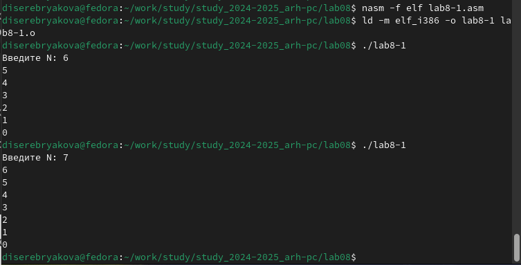{#fig:006 width=70%}

## Обработка аргументов командной строки

Создаю файл lab8-2.asm и ввожу в него текст программы из предложенного листинга (рис. [-@fig:007]).

{#fig:007 width=70%}

Создаю исполняемый файл и запускаю его, указав предложенные аргументы. Командой было обработано 4 аргумента – столько же, сколько и введено (рис. [-@fig:008]).

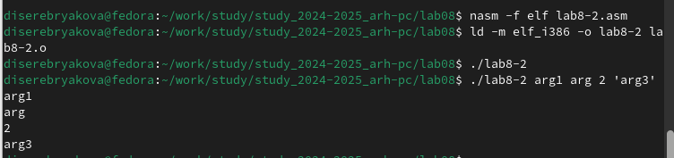{#fig:008 width=70%}

Командой touch создаю файл lab8-3.asm и ввожу в него текст программы из предложенного листинга (рис. [-@fig:009]).

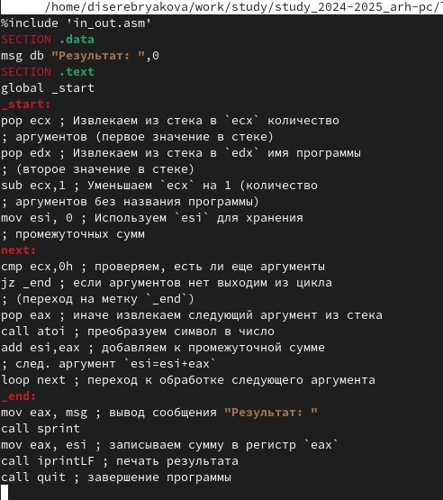{#fig:009 width=70%}

Создаю исполняемый файл и запускаю его, указав несколько чисел в качестве аргументов. Программа считает их сумму и выводит результат на экран (рис. [-@fig:010]).

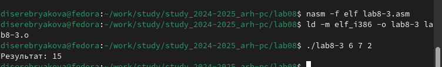{#fig:010 width=70%}

Изменяю текст программы так, чтобы она считала произведение введенных аргументов и выводила на экран (рис. [-@fig:011]).

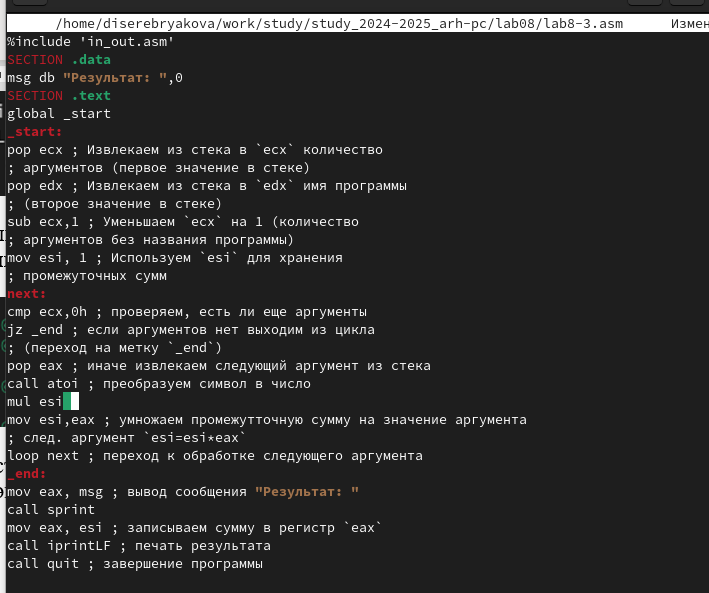{#fig:011 width=70%}

Создаю исполняемый файл и запускаю его. Теперь программа перемножает заданные аргументы (рис. [-@fig:012]).

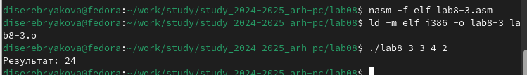{#fig:012 width=70%}

# Выполнение заданий для самостоятельной работы

Командой touch создаю файл lab8-4.asm и прописываю в нем текст программы, которая будет подсчитывать сумму значений функции при заданных аргументах (рис. [-@fig:013]).

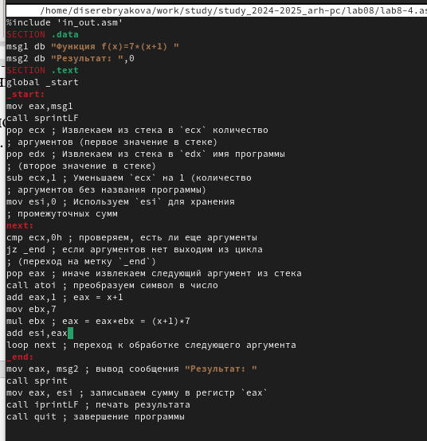{#fig:013 width=70%}

Создаю исполняемый файл и запускаю его несколько раз на разных значениях аргументов. Результат получается верный, значит программа написана корректно (рис. [-@fig:014]).

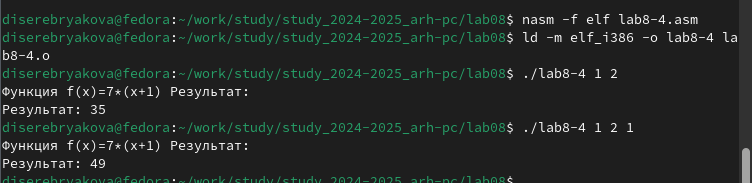{#fig:014 width=70%}

# Выводы

Приобретены навыки написания программ с использованием циклов и обработкой аргументов командной строки

# Список литературы{.unnumbered}

1. Лабораторная работа 8
