---
## Front matter
title: "Лабораторная работа №9"
subtitle: "Дисциплина: Архитектура компьютера"
author: "Серебрякова Дарья Ильинична"

## Generic otions
lang: ru-RU
toc-title: "Содержание"

## Bibliography
bibliography: bib/cite.bib
csl: pandoc/csl/gost-r-7-0-5-2008-numeric.csl

## Pdf output format
toc: true # Table of contents
toc-depth: 2
lof: true # List of figures
lot: true # List of tables
fontsize: 12pt
linestretch: 1.5
papersize: a4
documentclass: scrreprt
## I18n polyglossia
polyglossia-lang:
  name: russian
  options:
	- spelling=modern
	- babelshorthands=true
polyglossia-otherlangs:
  name: english
## I18n babel
babel-lang: russian
babel-otherlangs: english
## Fonts
mainfont: IBM Plex Serif
romanfont: IBM Plex Serif
sansfont: IBM Plex Sans
monofont: IBM Plex Mono
mathfont: STIX Two Math
mainfontoptions: Ligatures=Common,Ligatures=TeX,Scale=0.94
romanfontoptions: Ligatures=Common,Ligatures=TeX,Scale=0.94
sansfontoptions: Ligatures=Common,Ligatures=TeX,Scale=MatchLowercase,Scale=0.94
monofontoptions: Scale=MatchLowercase,Scale=0.94,FakeStretch=0.9
mathfontoptions:
## Biblatex
biblatex: true
biblio-style: "gost-numeric"
biblatexoptions:
  - parentracker=true
  - backend=biber
  - hyperref=auto
  - language=auto
  - autolang=other*
  - citestyle=gost-numeric
## Pandoc-crossref LaTeX customization
figureTitle: "Рис."
tableTitle: "Таблица"
listingTitle: "Листинг"
lofTitle: "Список иллюстраций"
lotTitle: "Список таблиц"
lolTitle: "Листинги"
## Misc options
indent: true
header-includes:
  - \usepackage{indentfirst}
  - \usepackage{float} # keep figures where there are in the text
  - \floatplacement{figure}{H} # keep figures where there are in the text
---

# Цель работы

Приобретение навыков написания программ с использованием подпрограмм. Знакомство
с методами отладки при помощи GDB и его основными возможностями.

# Задания

1. Ознакомиться с понятием отладки
2. Ознакомиться со структурой подпрограмм
3. Научиться работать с подпрограммами и отладкой с помощью GDB

# Теоретическое введение

## Понятие об отладке

Отладка — это процесс поиска и исправления ошибок в программе. В общем случае его
можно разделить на четыре этапа:

• обнаружение ошибки;
• поиск её местонахождения;
• определение причины ошибки;
• исправление ошибки.

Можно выделить следующие типы ошибок:

• синтаксические ошибки — обнаруживаются во время трансляции исходного кода и
вызваны нарушением ожидаемой формы или структуры языка;
• семантические ошибки — являются логическими и приводят к тому, что программа
запускается, отрабатывает, но не даёт желаемого результата;
• ошибки в процессе выполнения — не обнаруживаются при трансляции и вызывают прерывание выполнения программы (например, это ошибки, связанные с переполнением
или делением на ноль).

Второй этап — поиск местонахождения ошибки. Некоторые ошибки обнаружить довольно трудно. Лучший способ найти место в программе, где находится ошибка, это разбить
программу на части и произвести их отладку отдельно друг от друга.

Третий этап — выяснение причины ошибки. После определения местонахождения ошибки
обычно проще определить причину неправильной работы программы.

Последний этап — исправление ошибки. После этого при повторном запуске программы,
может обнаружиться следующая ошибка, и процесс отладки начнётся заново.

## Методы отладки

Наиболее часто применяют следующие методы отладки:

• создание точек контроля значений на входе и выходе участка программы (например,
вывод промежуточных значений на экран — так называемые диагностические сообщения);
• использование специальных программ-отладчиков.

Отладчики позволяют управлять ходом выполнения программы, контролировать и изменять данные. Это помогает быстрее найти место ошибки в программе и ускорить её
исправление. Наиболее популярные способы работы с отладчиком — это использование
точек останова и выполнение программы по шагам.
Пошаговое выполнение — это выполнение программы с остановкой после каждой строчки,
чтобы программист мог проверить значения переменных и выполнить другие действия.
Точки останова — это специально отмеченные места в программе, в которых программаотладчик приостанавливает выполнение программы и ждёт команд. Наиболее популярные
виды точек останова:

• Breakpoint — точка останова (остановка происходит, когда выполнение доходит до
определённой строки, адреса или процедуры, отмеченной программистом);
• Watchpoint — точка просмотра (выполнение программы приостанавливается, если
программа обратилась к определённой переменной: либо считала её значение, либо
изменила его).

Точки останова устанавливаются в отладчике на время сеанса работы с кодом программы, т.е. они сохраняются до выхода из программы-отладчика или до смены отлаживаемой
программы.

# Выполнение лабораторной работы

## Реализация подпрограмм в NASM

Создаю каталог для выполнения лабораторной работы № 9, перехожу в него и создаю файл lab09-1.asm (рис. [-@fig:001]).

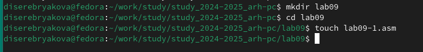{#fig:001 width=70%}

Изучаю текст программы из предложенного листинга и ввожу его в только что созданный файл (рис. [-@fig:002]).

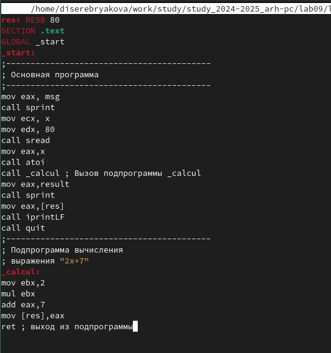{#fig:002 width=70%}

Создаю исполняемый файл и проверяю его работу (рис. [-@fig:003]).

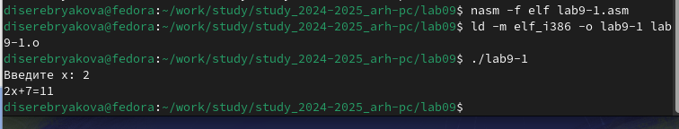{#fig:003 width=70%}

Значение функции при введенном с клавиатуры х посчитано верно. Изменяю текст программы, добавив подпрограмму _subcalcul в подпрограмму _calcul, для вычисления выражения f(g(x)), где x вводится с клавиатуры, f(x)= 2x+7, g(x)=3x+1 (рис. [-@fig:004]).

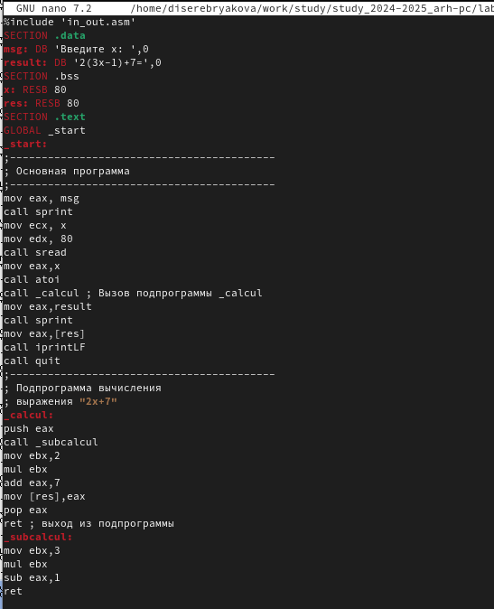{#fig:004 width=70%}

Создаю исполняемый файл и запускаю его (рис. [-@fig:005]).

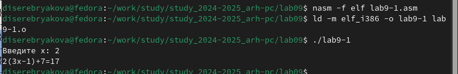{#fig:005 width=70%}

Значение подсчитано верно, значит программа написана правильно

## Отладка программам с помощью GDB

Создаю файл lab09-2.asm и ввожу в него текст программы из предложенного листинга (рис. [-@fig:006]).

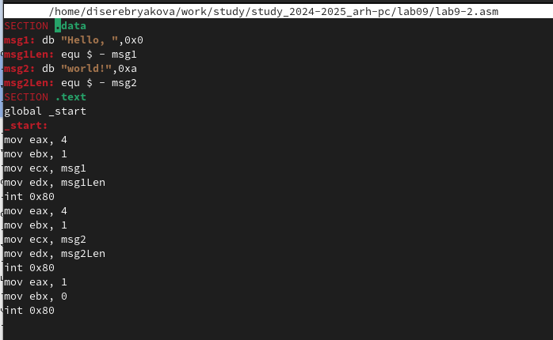{#fig:006 width=70%}

Создаю исполняемый файл, добавив отладочную информацию для работы с GDB. Проверяю работу программы, запустив ее в оболочке GDB с помощью команды run (рис. [-@fig:007]).

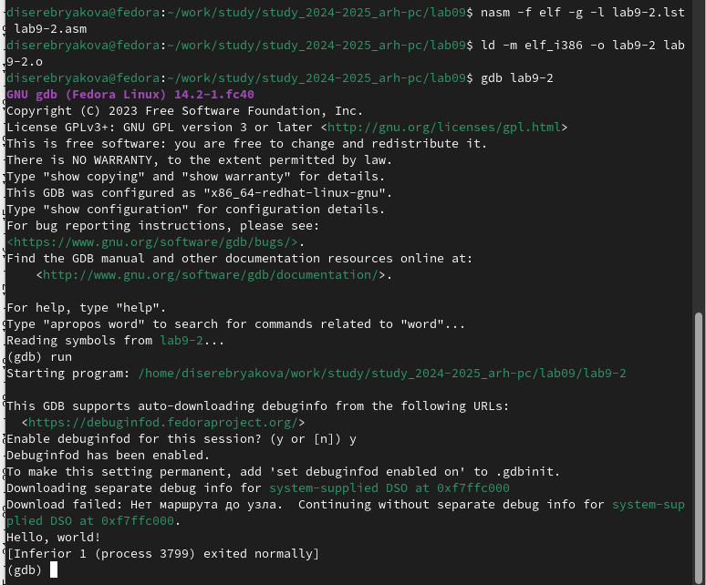{#fig:007 width=70%}

Для более подробного анализа программы устанавливаю брейкпоинт на метку _start, с которой начинается выполнение любой ассемблерной программы, и запускаю её командой run (рис. [-@fig:008]).

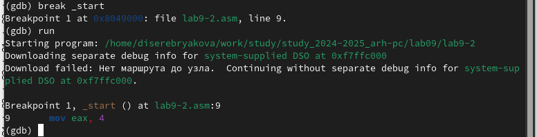{#fig:008 width=70%}

Далее просматриваю дисассимилированный код программы с помощью команды disassemble начиная с метки _start (рис. [-@fig:009]).

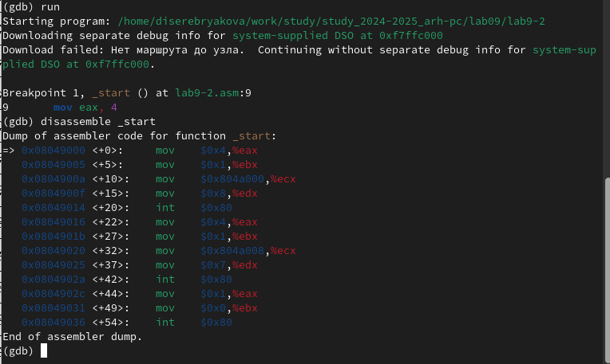{#fig:009 width=70%}

Переключаюсь на отображение команд с Intel’овским синтаксисом (рис. [-@fig:010]).

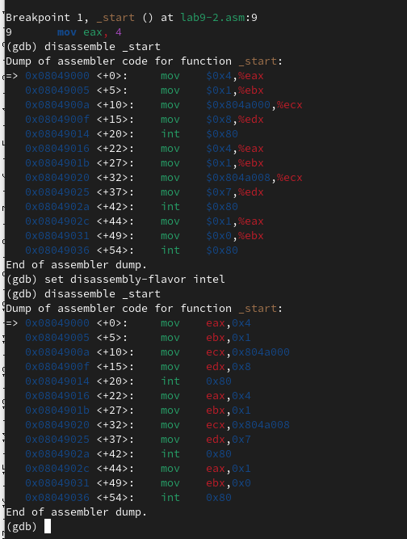{#fig:010 width=70%}

Различия между синтаксисом ATT и Intel заключаются в порядке операндов (ATT - Операнд источника указан первым. Intel - Операнд назначения указан первым), их размере (ATT - pазмер операндов указывается явно с помощью суффиксов, непосредственные операнды предваряются символом $; Intel - Размер операндов неявно определяется контекстом, как ax, eax, непосредственные операнды пишутся напрямую), именах регистров(ATT - имена регистров предваряются символом %, Intel - имена регистров пишутся без префиксов).

Включаю режим псевдографики для более удобного анализа программы (рис. [-@fig:011]).

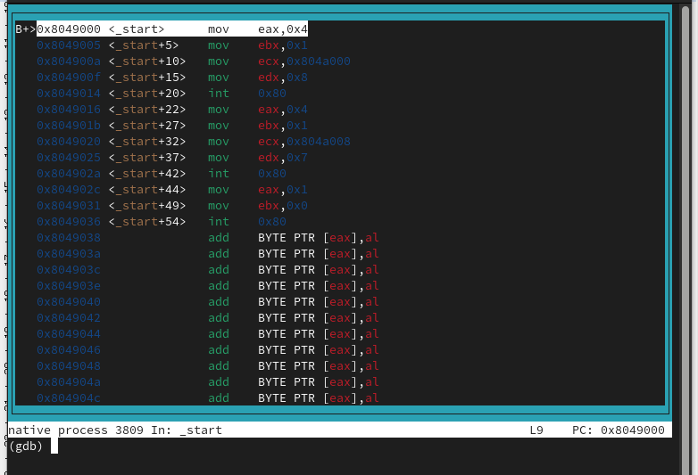{#fig:011 width=70%}

## Добавление точек останова

На предыдущих шагах была установлена точка останова по имени метки (_start). Проверяю это с помощью команды info breakpoints (рис. [-@fig:012]).

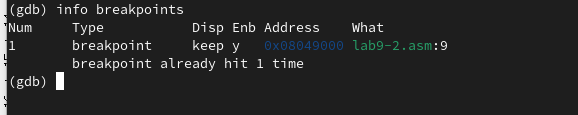{#fig:012 width=70%}

Устанавливаю еще одну точку останова по адресу предпоследней инструкции 
(mov ebx,0x0) и просматриваю информацию о всех установленных точках останова (рис. [-@fig:013]).

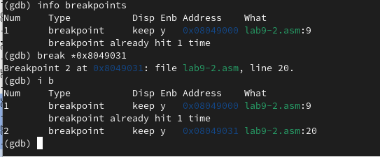{#fig:013 width=70%}

## Работа с данными программы в GDB

Смотрю содержимое регистров с помощью команды info registers (рис. [-@fig:014]).

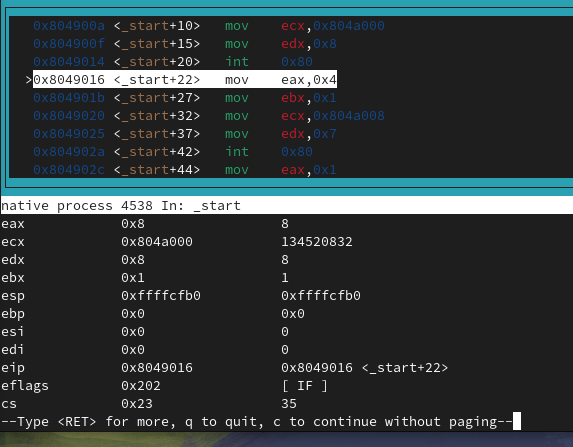{#fig:014 width=70%}

Смотрю значение переменной msg1 по имени (рис. [-@fig:015]).

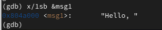{#fig:015 width=70%}

Смотрю значение переменной msg2 по адресу (рис. [-@fig:016]).

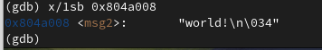{#fig:016 width=70%}

Меняю первый символ переменной msg1 и первый символ переменной msg2 (рис. [-@fig:017]).

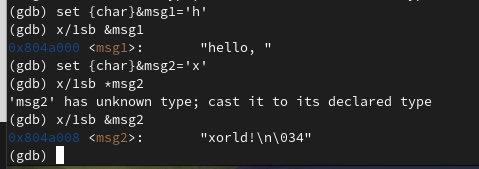{#fig:017 width=70%}

С помощью команды set изменяю значение регистра ebx (рис. [-@fig:018]).

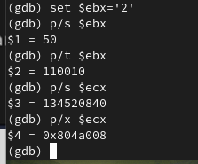{#fig:018 width=70%}

## Обработка аргументов командной строки в GDB

Копирую файл lab8-2.asm, созданный при выполнении лабораторной работы №8, с программой выводящей на экран аргументы командной строки в файл с именем lab09-3.asm (рис. [-@fig:019]).

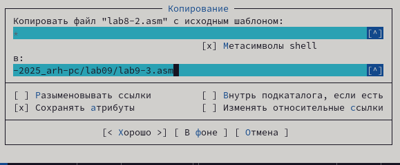{#fig:019 width=70%}

Создаю исполняемый файл и загружаю исполняемый файл в отладчик, указав аргументы (рис. [-@fig:020]).

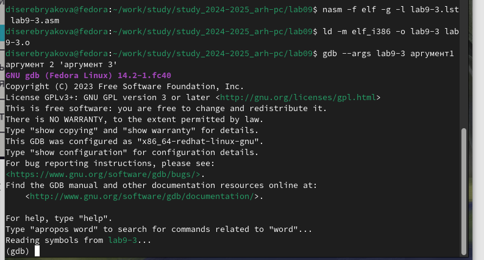{#fig:020 width=70%}

Исследую расположение аргументов командной строки в стеке после запуска программы с помощью gdb. Для начала устанавливаю точку останова перед первой инструкцией в программе и запускаю ее (рис. [-@fig:021]).

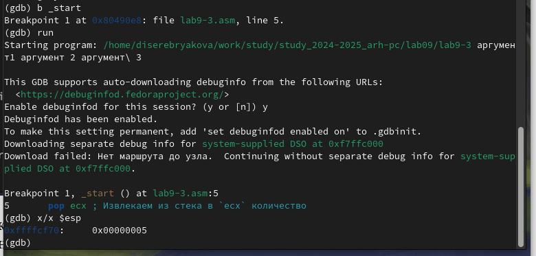{#fig:021 width=70%}

Адрес вершины стека храниться в регистре esp и по этому адресу располагается число равное количеству аргументов командной строки (включая имя программы). Как видно, число аргументов равно 5 – это имя программы lab09-3 и непосредственно аргументы: аргумент1, аргумент, 2 и 'аргумент 3'.

Просматриваю остальные позиции стека. По адесу [esp+4] располагается адрес в памяти где находиться имя программы, по адесу [esp+8] хранится адрес первого аргумента, по аресу [esp+12] – второго и т.д. (рис. [-@fig:022]).

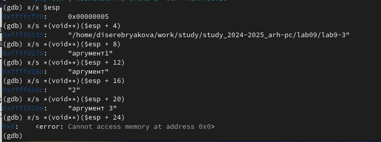{#fig:022 width=70%}

## Задания для самостоятельной работы

Создаю файл lab9-4.asm и ввожу в него программу из предложенного листинга (рис. [-@fig:023]).

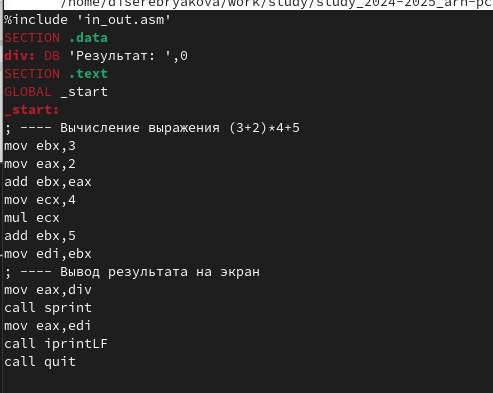{#fig:023 width=70%}

Запускаю программу в режике отладичка и пошагово через si просматриваю изменение значений регистров через i r. При выполнении инструкции mul ecx можно заметить, что результат умножения записывается в регистр eax, но также меняет и edx. Значение регистра ebx не обновляется напрямую, поэтому результат программы неверно подсчитывает функцию

Меняю код программы и запускаю ее повторно (рис. [-@fig:024]).

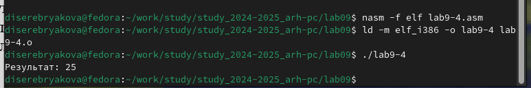{#fig:024 width=70%}

# Вывод

В ходе выполнения работы приобретены навыки написания программ с использованием подпрограмм. Также ознакомилась с методами отладки при помощи GDB и его основными возможностями

# Список литературы{.unnumbered}

Лабораторная работа №9
